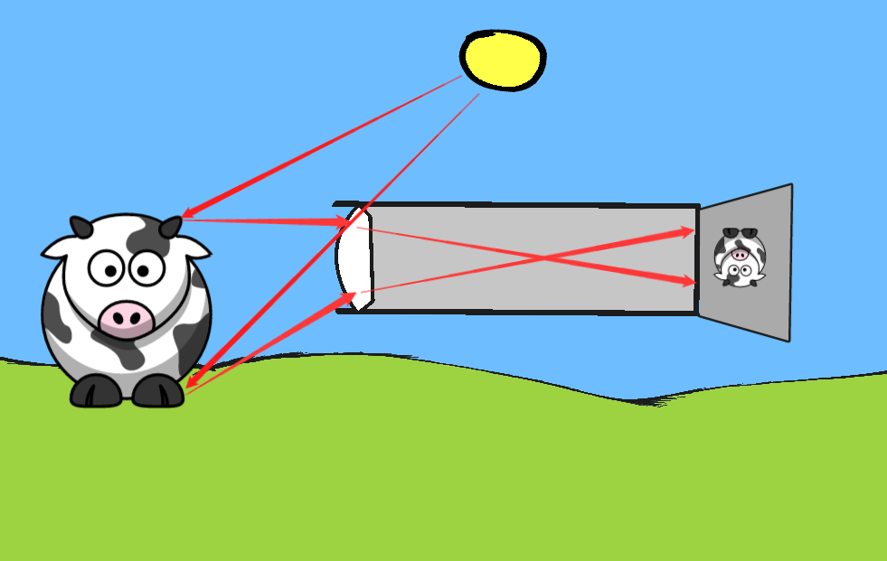

What's In Focus
==========

Sometimes when we take a photograph parts or all of it may be out of focus. Why is that?

* [Sketch.IO](https://sketch.io/sketchpad/)
* [Focus Example](http://stujo.github.io/photography-depth-of-field/samples/sidebyside.html)

# What We'll Explore

* How do we See Things?
* How does an Image form in a Camera?
* What is Focus?
* What is Depth of Field?
* What is an Aperture?

# A Cow in a Field on a Sunny Day

The Cow is Surprised we are interested, nods and continues to eat grass.

# Look at the Cow

How do we see the image of the cow?

# Light From the Sun

Light from the sun bounces off the cow and reaches our eyes travelling in a straight line. It's focused by the adjustible lens in our eye onto the retina at the back of the eyeball. The optic nerve sends the signals to the brain about what light is hitting where and the brain constructs some kind of representation of what we 'see'.

# A Camara Joins the Party

What happens? Describe the elements involved and how the image is captured.

# The Photograph of the Scene

The light bouncing off the cow enters lens and is bent as it passes through the lens. The image is focused on the film or sensor at the back of the camera. The scene is inverted.

# What is Focus?

Focus is when all the light reflected from a specific point in the 3D scene arrives at the same location on the sensor.

# What Happens?

What happens if the sensor is closer to the lens and everything else stays the same? What happens to the light from the cows nose?

# Depth of Field

Yes! The light reflected from the cow's nose is now spread out on the sensor, so it looks blurry or out of focus. However another part of the scene would now be in focus, that is, things a greater(?) distance from the camera would now be in focus.

Being *in focus* is somewhat subjective and also depends on the size of the resulting image and the sharpness required for a specific application. 

# Lens Ray Tracing

The focal point of a lens is where light entering perpendicular to the lens will be focused.

# Effect of Aperture?

What do you think is the effect on the depth of field if we place an aperture into the system?

Hint: An aperture reduces the size of the opening to the incoming light.

# Samples

* [Click Here](./samples.md)

# Review

* How do we See Things?
* How does an Image form in a Camera?
* What is Focus?
* What is Depth of Field?
* What is an Aperture?

# Bonus Materials

* [Samples](./samples.md)
* [Animated Gif](./samples.md)
* [Lens Combinations](https://www.youtube.com/watch?v=aHHa0cK_3as) Gives an overview of lens calculations

