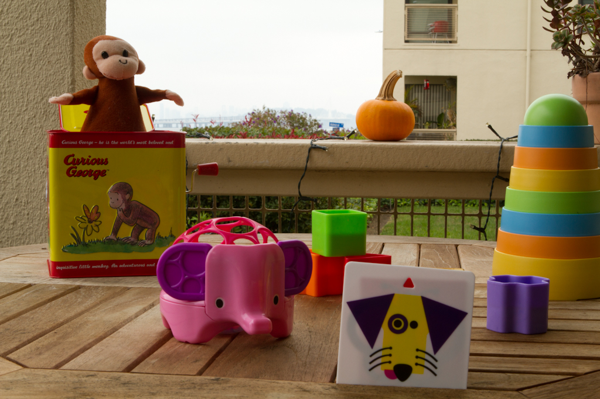

What's In Focus : Samples
==========

# f2.8 - Wide Aperture

We can see Curious George, but the pumpkin and the elephant are out of focus, the stacking Tower is a little soft, but might be acceptable. The building is very blurry as is everything in the distance.
 
# f5.6 - Wide Aperture

The Stacking Tower is now clearly in focus

# f13 - Narrow Aperture

Except for the dog cartoon the table contents are nicely in focus

# f22 - Very Small Aperture

Everything on the table is sharply focused. The road sign and the bridge in the background are reasonably visible on this cloudy day.

# Animated GIF f2.8 - f22

What do you think had to change for each exposure of this sequence so that the picture remains bright as the aperture gets smaller?

